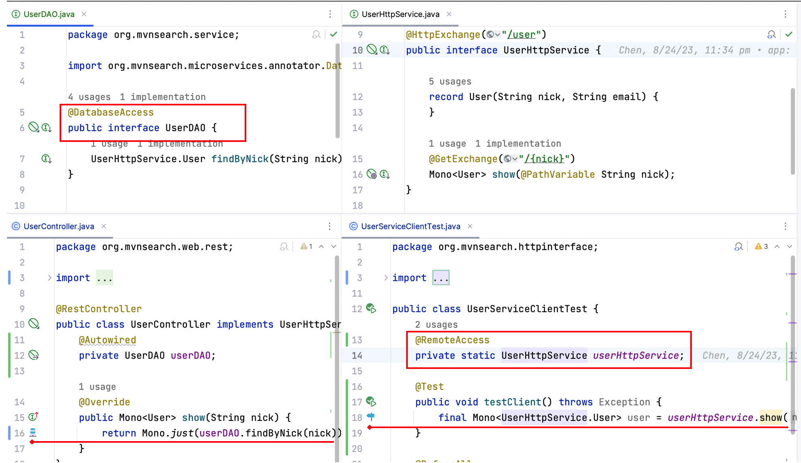

Microservices Annotator ext-plugin
===================================



<!-- Plugin description -->

[Microservices Annotator](https://plugins.jetbrains.com/plugin/18361-microservices-annotator) extension plugin with
annotations support.

Usage:

* Add Microservices Annotator dependency

```xml

<dependency>
    <groupId>org.mvnsearch</groupId>
    <artifactId>microservices-annotator</artifactId>
    <version>0.2.1</version>
</dependency>
```

* Add annotation for class/field/parameter/variable.

```java

@RemoteAccess
public interface UserService {
    String findNickById(Integer id);
}

// or 
public class UserController {
    @RemoteAccess
    private UserService userService;
}
```

* Microservices annotator icon will be in the gutter when APIs called.

```
String nick = userService.findNickById(1);
```

Microservices Annotator interaction types and annotations:

* Broadcast Data transmission: @Broadcast
* Cloud Storage Access: @CloudStorage
* Database Access: @DatabaseAccess
* Data Access: @DataAccess
* File System Operations: @FileOps
* IO Read: @IORead
* IO Write: @IOWrite
* Message Receive: @MessageReceive
* Message Send: @MessageSend
* Streaming: @Streaming
* Network Request: @RemoteAccess
* External Process: @ExternalProcess
* JNI/FFI(Foreign Function Interface) Call: @ForeignAccess

<!-- Plugin description end -->

## Installation

- Using IDE built-in plugin system:

  <kbd>Settings/Preferences</kbd> > <kbd>Plugins</kbd> > <kbd>Marketplace</kbd> > <kbd>Search for "microservices-annotator-ext-plugin"</kbd> >
  <kbd>Install Plugin</kbd>

- Manually:

  Download the [latest release](https://github.com/linux-china/microservices-annotator-ext-plugin/releases/latest) and
  install it manually using
  <kbd>Settings/Preferences</kbd> > <kbd>Plugins</kbd> > <kbd>⚙️</kbd> > <kbd>Install plugin from disk...</kbd>

# References

* Microservices Annotator annotations: https://github.com/linux-china/microservices-annotator
* Microservices Annotator plugin: https://plugins.jetbrains.com/plugin/18361-microservices-annotator